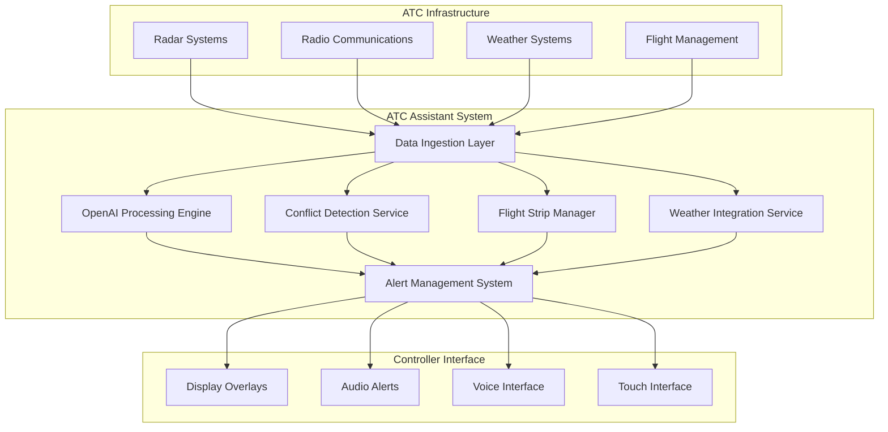

# ATC Assistant System Design Document

## Overview

The ATC Assistant System is a real-time AI-powered platform that enhances air traffic control operations at EWR airport. The system integrates with existing ATC infrastructure through non-intrusive interfaces, leveraging OpenAI's API for natural language processing and decision support while maintaining the critical safety and reliability standards required for aviation operations.

The architecture follows a microservices approach with redundant failsafes, ensuring that any system failure does not compromise primary ATC operations. The system operates as an overlay that augments controller capabilities rather than replacing human decision-making.

## Architecture

### High-Level Architecture



### System Components

#### 1. Data Ingestion Layer
- **Radio Interface Module**: Captures and processes ATC radio communications using open-source radio libraries
- **Radar Data Processor**: Interfaces with existing radar systems through standard protocols (ASTERIX, ARINC)
- **Weather Data Collector**: Aggregates meteorological data from multiple sources (METAR, TAF, NEXRAD)
- **Flight Data Interface**: Connects to flight management systems for aircraft information

#### 2. OpenAI Processing Engine
- **Speech-to-Text Service**: Converts radio audio to text using OpenAI Whisper API
- **Natural Language Processor**: Analyzes communications for phraseology compliance using GPT-4
- **Decision Support Agent**: Provides conflict resolution suggestions and operational recommendations
- **Context Manager**: Maintains situational awareness across all system components

#### 3. Core Services
- **Conflict Detection Service**: Real-time aircraft separation monitoring with predictive analytics
- **Flight Strip Manager**: Automated flight progress strip creation and updates
- **Weather Integration Service**: Weather-aware decision support and impact analysis
- **Alert Management System**: Prioritized notification system with configurable thresholds

## Components and Interfaces

### Data Flow Architecture

1. **Input Processing Pipeline**
   - Audio streams from radio systems → Speech-to-Text → NLP Analysis
   - Radar data → Position tracking → Conflict detection algorithms
   - Weather data → Impact analysis → Operational recommendations
   - Flight plans → Strip generation → Status tracking

2. **AI Processing Layer**
   - OpenAI GPT-4 for natural language understanding and generation
   - Custom conflict detection algorithms with machine learning enhancement
   - Predictive modeling for traffic flow optimization
   - Real-time decision tree processing for alert prioritization

3. **Output Generation**
   - Visual overlays on existing controller displays
   - Audio alerts through existing communication systems
   - Voice interface for hands-free interaction
   - Touch interface for quick acknowledgments and inputs

### Integration Interfaces

#### External System Interfaces
- **ASTERIX Protocol Handler**: For radar data integration
- **ARINC 424 Parser**: For navigation database access
- **ICAO AIXM Interface**: For aeronautical information exchange
- **SWIM (System Wide Information Management)**: For FAA data sharing

#### OpenAI API Integration
- **Whisper API**: Real-time speech transcription with custom aviation vocabulary
- **GPT-4 API**: Natural language processing with aviation-specific prompts
- **Function Calling**: Structured data extraction from communications
- **Embeddings API**: Similarity matching for phraseology compliance

## Data Models

### Core Data Structures

```typescript
interface Aircraft {
  callsign: string;
  flightPlan: FlightPlan;
  currentPosition: Position3D;
  velocity: Vector3D;
  altitude: number;
  heading: number;
  squawkCode: string;
  status: AircraftStatus;
  clearances: Clearance[];
  lastUpdate: timestamp;
}

interface FlightStrip {
  id: string;
  aircraft: Aircraft;
  route: string;
  altitude: number;
  speed: number;
  remarks: string;
  controllerActions: ControllerAction[];
  systemAlerts: Alert[];
}

interface Conflict {
  id: string;
  aircraftInvolved: Aircraft[];
  conflictType: ConflictType;
  timeToConflict: number;
  severity: SeverityLevel;
  resolutionOptions: ResolutionOption[];
  status: ConflictStatus;
}

interface RadioTransmission {
  timestamp: Date;
  frequency: string;
  callsign: string;
  controller: string;
  audioData: Buffer;
  transcription: string;
  confidence: number;
  phraseologyCompliance: ComplianceResult;
}
```

### Database Schema
- **Time-series database** (InfluxDB) for aircraft positions and radar data
- **Document database** (MongoDB) for flight strips and communications logs
- **Redis cache** for real-time conflict detection and alert management
- **PostgreSQL** for configuration, user preferences, and audit trails

## Error Handling

### Fault Tolerance Strategy

1. **Graceful Degradation**
   - System operates in reduced functionality mode if OpenAI API is unavailable
   - Local fallback algorithms for critical conflict detection
   - Cached responses for common phraseology checks
   - Manual override capabilities for all automated functions

2. **Data Validation and Sanitization**
   - Input validation for all external data sources
   - Confidence scoring for AI-generated recommendations
   - Cross-validation between multiple data sources
   - Automatic flagging of inconsistent or suspicious data

3. **System Monitoring and Recovery**
   - Real-time health monitoring of all system components
   - Automatic failover to backup systems
   - Alert escalation for system administrators
   - Comprehensive logging for post-incident analysis

### Error Categories and Responses

- **Communication Errors**: Retry with exponential backoff, fallback to cached data
- **AI Processing Errors**: Use simplified algorithms, flag for manual review
- **Data Quality Issues**: Validate against multiple sources, alert controllers
- **System Overload**: Implement rate limiting, prioritize critical functions

## Testing Strategy

### Testing Approach

1. **Unit Testing**
   - Individual component testing with mock data
   - API integration testing with OpenAI services
   - Data validation and transformation testing
   - Algorithm accuracy testing with historical data

2. **Integration Testing**
   - End-to-end workflow testing with simulated ATC scenarios
   - Real-time data processing pipeline validation
   - Cross-system communication testing
   - Performance testing under various load conditions

3. **Safety and Reliability Testing**
   - Failure mode analysis and testing
   - Stress testing with high traffic scenarios
   - Latency and response time validation
   - Accuracy testing with recorded ATC communications

4. **User Acceptance Testing**
   - Controller workflow integration testing
   - Interface usability testing with actual controllers
   - Alert effectiveness and false positive rate analysis
   - Training scenario validation

### Test Data and Environments

- **Simulation Environment**: Full ATC simulator with synthetic traffic
- **Historical Data Testing**: Recorded radar and communication data from EWR
- **Controlled Testing**: Limited deployment with experienced controllers
- **Performance Benchmarks**: Response time and accuracy metrics validation

### Compliance and Certification

- **FAA Order 8110.49**: Software approval guidelines for aviation systems
- **DO-178C**: Software considerations in airborne systems and equipment certification
- **Security Standards**: Cybersecurity framework compliance for critical infrastructure
- **Data Privacy**: Compliance with aviation data handling regulations